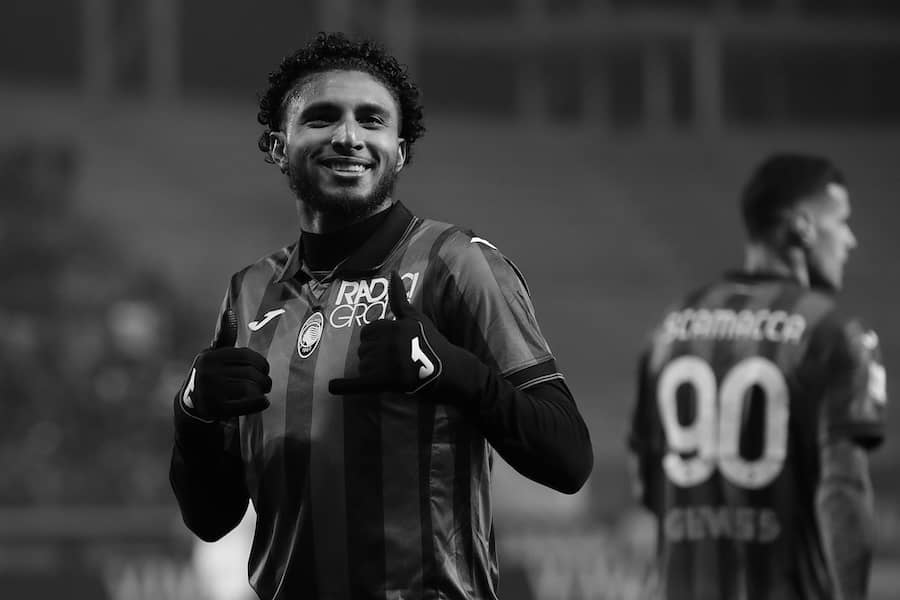

This time last year Newcastle United had just snuck a 1-0 first away leg over Southampton en route to their first cup final appearance in 24 years. Joelinton tapped in from close range after Alexander Isak's sublime work on the wing. You could sense the Cup Final @ Wembley on the horizon & the prospect of Champions League qualification bubbling away in the background; all things were rosy on Tyneside.
January 2024, however, has brought about its own set of challenges, transfer rumours, and a substantial dip in form – but all to be expected, it is worth remembering that given that the club are building.

### Trippier linked with German joust

One of the more left-field transfer debacles that January has produced is the potential departure of our leader, talisman and standard-bearer Kieran Trippier to German serial champions Bayern Munich. The right-back was subject to three bids from Thomas Tuchel's outfit, each of which was rejected - and the interest has since officially ended. It appears that Tripps would have been open to the move to reunite with his former Spurs teammates, and possibly give the Champions League one proper final go before his career at the top level starts to see the twilight. More importantly, however, was the insistence from the club behind that scenes that Trippier wasn't going anywhere. Most notably the word was that the Bury-born man did not agitate for the move. The debacle looks over, thankfully.

### Guimarães to be the first 'big trade'?

Big-name departures will become a regular thing at Newcastle United. It is part of the model to grow this football club. You can count on one hand the amount of teams in world football that are immune to having their big star players lured away, and NUFC aren't part of that list quite yet. The summer transfer window will see Eddie Howe's men lose a big player in what is expected to be a sizeable transfer fee. **Bruno Guimarães** is expected to be that player, with murmurs of Barcelona, PSG, and Liverpool eyeing up the radge Brazilian.

Bruno's most recently signed deal includes a release clause somewhere in the region of £100m. There aren't many teams in the world that can afford that transfer, but PSG & Liverpool are certainly up there. Ideally in any case of Guimarães leaving – and it seems like that will happen in the summer – it will be to a team abroad. Barcelona are known admirers, but their finances are questionable to say the very least. It wouldn't be overly enjoyable lining up against Bruno in midfield if he was to join a domestic rival but what'll happen, will happen. PSG seem the front-runners for his signature.

### Crucial to keep ahold of Botman & Isak

In a summer transfer window that is due to have a domino effect for all clubs with PSR and all that craic - it's crucial that we keep **Sven Botman** and **Alexander Isak**. I would argue, albeit controversially, that they are more important members of the side than Bruno; Botman brings composure and assertiveness to our back line, while Isak is a natural goalscorer.

Both players are at an ideal age and stage of their career to push on with Newcastle United and achieve success. Botman will only get better and become more dominant as a Premier League defender, while Isak oozes class; his ability to dribble & glide around the pitch and finish his chances in front of goal without hesitation give very strong Thierry Henry vibes. There is little doubt that the duo are going to go on and do big things in their respective careers, ~~hopefully~~ with or without Newcastle United.

Thankfully both look 'off-limits' in terms of summer departures, unless a truly ridiculous offer comes in for either. For all intents and purposes, they are integral to the foreseeable growth of NUFC.

### Summer transfer targets already touted

For all the departure talk, there has also been plenty of names linked with an arrival at Newcastle United. **Amadou Onana** of Everton and **Éderson** of Atalanta have known admirers at St. James' Park, and it is easy to see why. They fit the model and profile of the recruitment remit on Tyneside.

Onana has been linked with Arsenal and beyond, and with Everton's financial worries, there will be plenty of teams looking to take advantage of their predicament. The Belgium international only arrived in August 2022, but has proven himself in the rugged Premier League environment.

Éderson on the other-hand has long-term admirers in Steve Nickson and co. With talk of a potential departure of Joelinton, it is a move that could spring into action if the club fail to agree a new contract with Big Joe. Spurs have been credited with interest in the Seria A midfielder as recently as today (at the time of writing) and there undoubtedly be others.

The 2024 summer transfer window will be a big one for Newcastle United, as the club move into 'stage two' of post-takeover transition. While it seems inevitable that one big name will leave in a summer sale, we can be certain that those funds will be reinvested to help progress this football club further – something that proved wishful thinking in the era of Mike Ashley.
