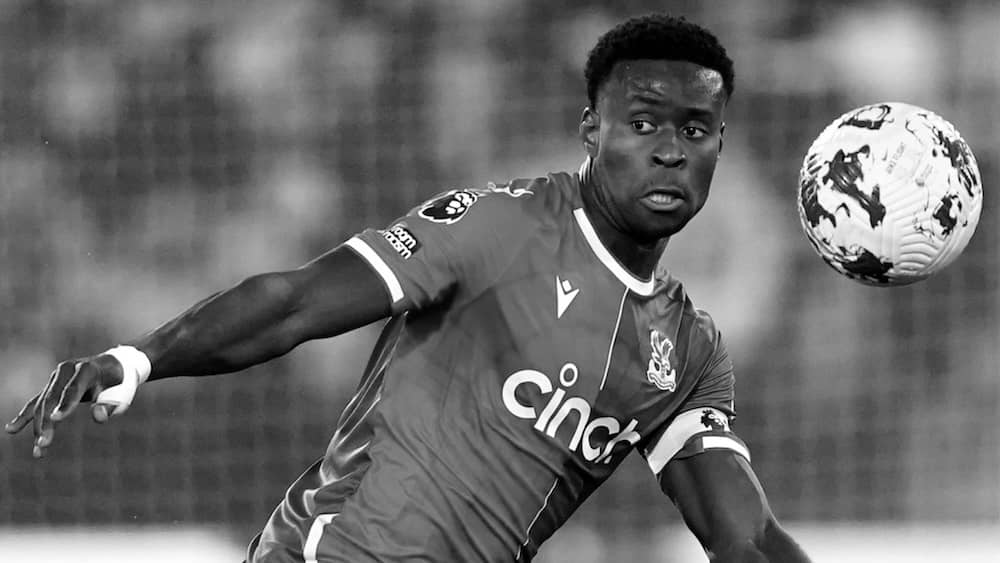

The close of the summer transfer window brought to an end what can only be considered an underwhelming transfer window on Tyneside. In the midst of some questionable 'player trading' we also saw Newcastle United appoint a new Sporting Director in Paul Mitchell, as co-owners & proclaimed guardians Amanda Staveley and Mehrdad Ghodoussi both departed their roles at the club. It marked a noticeable shift in dynamics at a boardroom level, with the appointment of the highly rated Mitchell - and brought about hope of a slicker football operation from the top down. By the time the transfer window shut, however, there was a sense of bewilderment left amongst supporters as to how the club somehow finished the transfer period weaker than when they had entered.

### PSR scramble shines light on management shortcomings

Who knew that a three-letter acronym would cause so panic across the Premier League. The mention of **Profit and Sustainability Rules** and its June 30th deadline had many teams scrambling to buy players they didn't want/need, and sell promising academy talents who felt set for first team football. Aston Villa and Chelsea played a game of pingpong with their deadlings, Omari Kellyman heading to Stamford Bridge for £19m having made only two first team appearances, while Emery's side brought Ian Maatsen to Villa Park in return for £35m - both transactions seemingly ensuring lovely profits on their players, and satisfying PSR balance sheets in the meantime.

At Newcastle, the same malarky ensured the sale of exciting Geordie talent **Elliot Anderson** to Nottingham Forest for an eyebrow-raising £35m, with Howe's men 'luring' Forest's out of favour goalkeeper Odysseas Vlachodimos to Tyneside for a supposed staggering fee of £20m.
Promising winger **Yakuba Minteh** also left the building, joining Brighton for a fee in the region of £30m. Two necessary sales to stay within the PSR guidelines, but two departures that felt like a kick in the cojones given the potential of both players. It was to be the final act of Staveley & Ghodoussi's era at St. James' Park; its timing perhaps speaking for itself.

### Paul Mitchell arrives with a strong reputation & remit

The vacant Sporting Director post left by Dan Ashworth was finally filled on July 4th by a certain Paul Mitchell. The much-acclaimed footballing director arrived from AS Monaco after a four-year stint in France. It marked a professional appointment with his resumé boasting high-profile roles at Southampton, Spurs, RB Leipzig, Red Bull Soccer International.

Darren Eales welcomed the appointment with:

> "His extensive and diverse experience in football leadership, cultural change and recruitment mean he is the ideal person to lead our sporting directorate.

The hope of a strong summer transfer window, and what was left of it, remained intact. Newcastle were short of depth in defence, and ultimately needed another right-sided winger, and preferably a striker as well.

Fast-forwarded to the close of the window and fans are left bemused at the lack of transfer activity, somehow having ended up with a weaker squad on paper than before the 'trading window' opened. Free agent Lloyd Kelly, recently relegated William Osula, and free-agent John Ruddy all landed up North, in addition to Vlachodimos - because of course we needed two goalkeepers this window.

A month-long protracted pursuit of Crystal Palace defender **Marc Guehi** ended in stalemate, with Newcastle refusing to spend £70m on the England international, despite rumoured guarantees from Mitchell himself that the deal would be done.
I don't think any right-minded Newcastle fan would have any problem with the club refusing to pay such an inflated figure for Guehi, but it is the sheer amount of time they wasted negotiating with Palace that has irked folks. The guts of a month spent talking to just one target it seems, with no back-up plan, or suitable back-up plan for this window, apparent.

Joe Gomez was mentioned, as was Tapsoba of Bayern Leverkusen, but no action on either front post-Mitchell arrival. During the carnage of sorting out the checks and balances for PSR, Gomez to Newcastle seemed a goer, as revealed in a [fairly astonishing read by the Athletic](https://www.nytimes.com/athletic/5675357/2024/08/02/joe-gomez-liverpool-newcastle-anthony-gordon-transfer/).

Howe voiced his frustration about a disappointing window and rightly so, and one can't help feel that the change in the hierarchy has weaked his influence at the top table.

## Howe loses allies; Mitchell assured and outspoken

There is no doubt that Howe has lost allies in the boardroom with the departure of Staveley and her partner with the recent reshuffle. Some will argue that is not a good thing and could ultimately kick-off the start of the end for Eddie Howe at Newcastle United. Others will argue that the club and their appointment of Mitchell align it moreso with how top-level football clubs operate nowadays.

In an organised & brooding interview with various media, Mitchell was outspoken about the underwhelming window that passed, and touched on how things are in transition at the club, with much work to be done, particularly when it comes to recruitment.

> "Do we have to look at the way we recruit and scout and also do we have to look where we do? Because the market is complicated and we have seen the impact PSR has had.
> Should our scouting and recruitment be driven more extensively with a wider-reaching net? Of course, it needs to be and that’s the responsibility of me, the scouting team, the recruitment team and Eddie. To do that, to look at that. Is it fit for purpose?”

There is a strong feeling that Mitchell is pointing towards elements of mismanagement in the window by his predecessors, or a lack of long-term vision. It indicates a short-sighted recruitment remit, and that is something the ex-Monaco man is trying to change. It also, in my opinion, touches on the possible over-influence Howe has had in recruitment. Gone are the days of managers, they're all head coaches now, for good or for bad.

Albeit a disappointing window - it is too early to judge Paul Mitchell as he is only in the door. Despite that, he has naturally become the target of the transfer window criticisms, and the recent, coordinated interview is PR push back on his behalf.
While entitled to time to implement his blueprint, there's little doubt that the question of tension between and Howe will continue to linger - and that's not a good thing for the club.

Newcastle United are at 'stage two' of their transition following the Saudi takeover, and Eales & Mitchell are at the forefront of it.

Mitchell has had his airtime this week, and now it's time to get to work in preparation of what will undoubtedly be a crucial January transfer window as well. Maybe we'll have another crack at signing Marc Guehi?

Either way, interviews or no interviews, the Club need to keep pushing forward - onwards and upwards.
