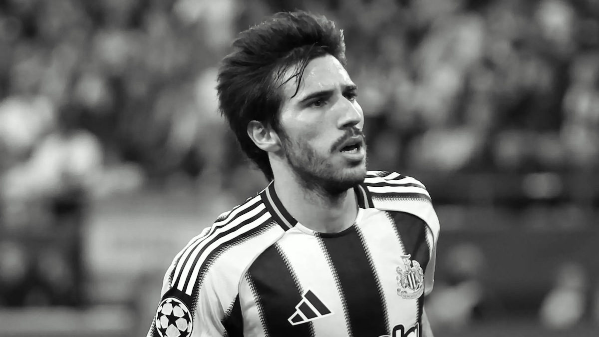
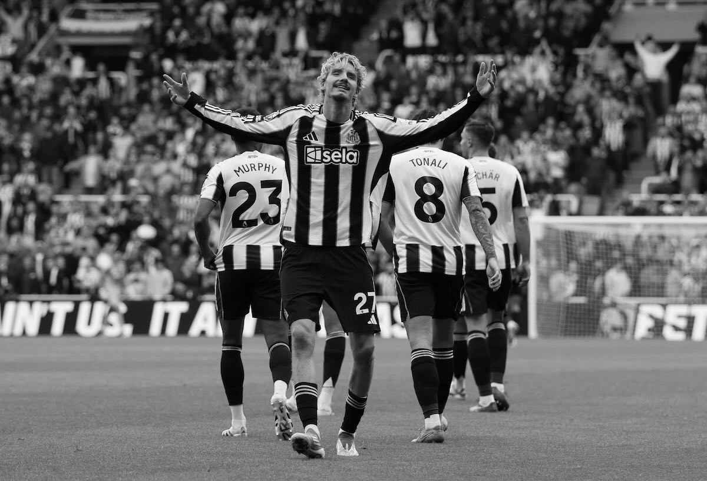
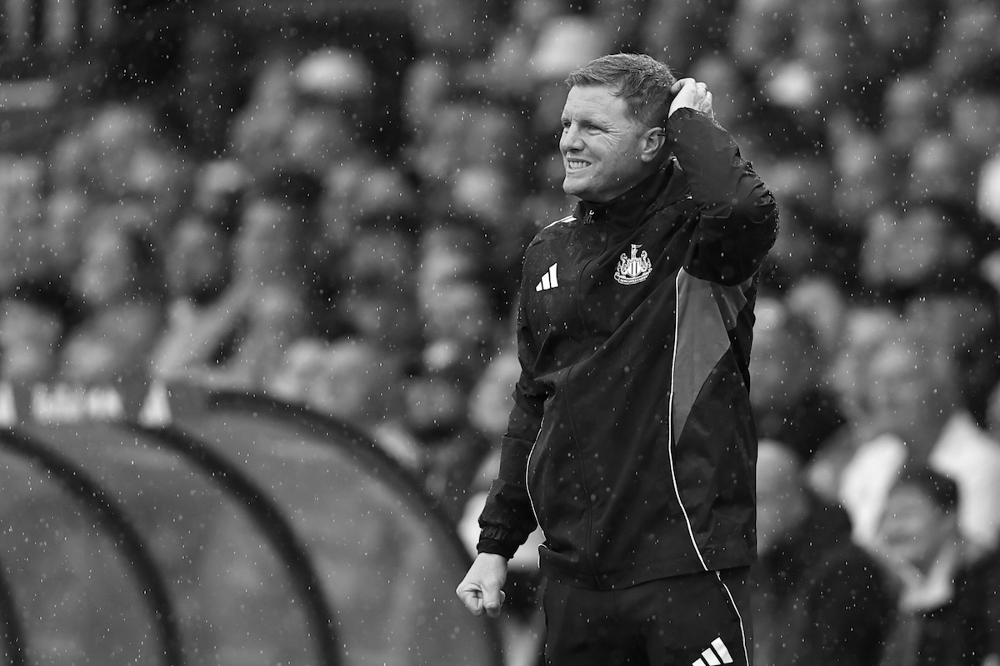

It is over 240 days since Newcastle United ended their trophy drought, a memorable day at Wembley. It is also well over a year since I last wrote an article on here, and a lot has happened on Tyneside since then, and I mean _a lot_. Paul Mitchell left and closed the gates behind him before he had to face the music that I had been building for him in my [most recent post](https://www.tynetime.com/2024/09/paul-mitchell-ready-deliver-newcastle-united/) on here; while a certain striker dominated the summer headlines with a forced move away from St. James' Park that left many fans irritated. Nevertheless, there's been delirium and drama over the past year, but that's the beauty of football, isn't it? As we enter the much-anticipated, much-dreaded international break, it gives me space to jot down a few NUFC thoughts of the present, and future - in no particular order.

### Tonali's long-waltz home to Italy 

Since returning from his gambling ban, Sandro Tonali has taken to life at Newcastle United in incredible fashion. The Italy midfielder soon established himself as a crucial cog in Eddie Howe's midfield and has proven himself as one of the best midfielders in the Premier League. Strong in the tackle, positionally aware, technical ability on the ball, discipline in a midfield three - he has been a joy to watch. An elite midfielder who has struck up a nice partnership with both Bruno and Joelinton - he's gone about his business in a professional manner.

Many folks would have questioned the £55m signing after he was landed with a 10-month ban, but as soon as he returned to fitness and first-team football, it was astonishing how quickly he started performing consistently at a top-class level, both for club and country.

Despite that, even since his arrival, there have been regular murmurs about Tonali and his desire to return to his homeland. Milan and Juve have been linked with the 25-year-old, and in a recent interview Tonali made no promises of what the future holds, whilst claiming he is happy in Black and White.

The reality is, Tonali will likely be one of the next Newcastle players off the taxi rank. He seems destined to return to Italy at some stage in the future; he does seem to yearn for home, and I'd be shocked if he didn't pull on the AC Milan colours again in the next three to five years.

His contractual situation will ensure any fee received will be a hefty one, and given how the Isak saga played out, I get the impression Tonali might just act more professional and leave on good terms, with both staff & fans. Whether it's a long-waltz back or not, Tonali has more to give NUFC and we should enjoy the ride – while it lasts.

### Thiaw justifying long-time admiration 

Continuing the theme of ex-Milan players, it brings me to Malick Thiaw. Signed towards the end of a frantic summer transfer window, Thiaw has eased into life on Tyneside and quickly become one of the standout performers. Good on the ball, solid range of passing between the lines, and tactically tuned in, the German is close to nailing-down his first team spot.

Having just turned 24 in August, Thiaw is of an excellent age profile and 'fit' for Newcastle United. It is well-known that Thiaw has been tracked by NUFC for a few years now, so to finally get our man - and to do so relatively under the radar - is beginning to look like excellent business. He seems to be Schar's long-term replacement, and that transition appears to be happening quicker that first anticipated.

### Woltemade to welcome Wissa reprieve 

Like his German compatriot, Nick Woltemade has made a strong start to life with the Magpies. A towering presence up top, the 23-year-old has shown glimpses of what is to come with a handful of goals in his opening games. Although naturally highlighted for his towering figure; Woltemade's quick feet, close control, and vision are what most excites me. He is very tough to dispossess, and his ability to drop-deep to sew attacks together will prove very interesting once our other signing up top - Yoane Wissa - makes his long-awaited debut.

Wissa joined for an eye-watering £50m from Brentford, but has yet to kick a ball in Black and White. After excelling in London over the past couple of years, Wissa finished last season with 18 Premier League goals, which is an incredible achievement given his partner Bryan Mbuemo netted 20 - a phenomenal return for both men.

The return / _debut_ of Wissa will take pressure off Nick, as they will share the duties up front in the immediate future, however; I am hopeful that we see both play together before long. Woltemade can operate deeper, potentially behind Wissa - and contribute nicely to the DR Congo international's integration into first team football.

It beckons the possible change of shape / formation in the New Year once all folks are fit and raring to go, as I see Woltemade and Wissa both eventually starting in the same 11. Wissa's impending debut will at least – for now – take pressure and minutes off Big Nick, and that can only be a good thing.

### Eddie needs to experiment & evolve

Eddie Howe has started to come under the microscope in recent weeks after some dismal displays away from home in the league. Sunday's 1-3 defeat to Brentford followed a worrying trend on the road, with scary similarities to the previous week's defeat to West Ham.

Despite going one up and with a lead to build on, Newcastle lost steam and conceded three goals without reply. It marked two tepid performances, players looked exhausted and bereft of the intensity that has made them so successful over the years.
There was absolutely no creativity to be seen, and this stretches back more than just the past two weeks. Our late loss to Brighton on the road also reeked of little chance creation, only for a moment of magic from Woltemade to give us hope of a positive result.

Outside of over-the-top anger & trolling on social media, Howe has come in for criticism tactically, and for his choice of personnel. His loyalty to key characters of the squad has been questioned; and perhaps rightly so. Away from home we look fairly hopeless, there is little cohesion in midfield, and we don't look to have much threat on the counter attack, especially with Woltemade coming so deep to be involved, leaving little to no support ahead of him on the pitch. Howe needs to adapt to in-game situations quicker, and not let his loyalty to long-term squad members get in the way of experimentation.

That said, talk of replacing Howe still seems utterly ridiculous to me. He has plenty of credit in the bank, a trophy to his name, and has clearly learned from our last venture in the Champions League. We have been one of the best teams in the Champions League this campaign, mostly aided by home fixtures it must be said – but either way, we are on course to progress to the next round of the tournament, and this should not be underestimated. League form has been poor, there's little doubt about that, it has been a meagre points return for the fixtures we've had so far this season.

The absence of Livramento and Hall at full-back has started to hurt us in recent weeks, they are key cogs in the way we play, both defensively and going forward. Their timely returns will undoubtedly improve us as a team. Add Wissa's introduction into that at the other end of the pitch, and any talk of Howe vacating St. James' Park will likely look even more absurd than it already sounds, come Christmas – but one thing is for sure, if our league form doesn't improve, all options will need to be considered.
